# ReactDojo

> # **`React`**
>
> เป็น Library ของ Javascript ที่เอาไว้พัฒนา Web Application
>
> ## _`Create React Command`_
>
> ```
> npx create-react-app "Project Name"
> ```
>
> `Reference : ` https://github.com/facebook/create-react-app/
>
> ## **`Structure`**
>
> ### _`node_modules`_
>
> => เป็น folder ที่เก็บ package ต่างๆของ node รวมถึง package React ที่เราจะเอาไปสร้าง Component ต่างๆ
>
> ### _`public`_
>
> => เป็น folder ที่เก็บไฟล์ public ต่างๆ เช่น index.html,พวกรูปภาพ,โลโก้
>
> ### _`src`_
>
> => เป็น folder ที่เราใช้ในการทำงานต่างๆบน React
>
> ### _`package.json`_
>
> => เป็นไฟล์ที่มีรายละเอียดพวก dependency ต่างๆที่เราลง,script ต่างๆที่เราใช้ run,เครื่องมือ tool ต่างๆที่ถูก set ไว้ในตัว project นี้
>
> ### _`App.js`_
>
> => เป็นไฟล์ root component (`component หลัก`)
>
> ### _`index.js`_
>
> => เป็นไฟล์ที่เอาไว้ render root component (`App.js`) ให้ไปแสดงแทนที่ `<div id="root"></div> ` ใน main template (`index.html`)
>
> 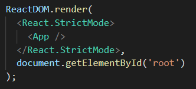
>
> ### _`index.html`_
>
> => เป็นไฟล์ main template
>
> 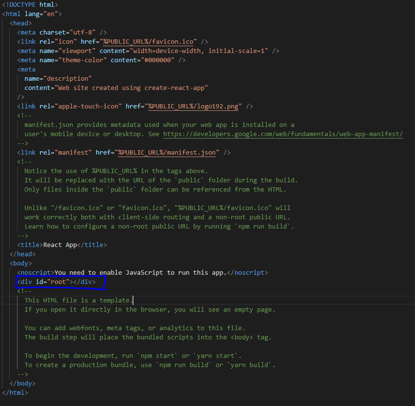
>
> `Note : ` flow react => index.html -> index.js -> App.js
>
> ## **`Component`**
>
> => เป็นส่วนประกอบเล็กๆที่นำมาประกอบกันเพื่อสร้างหน้า web application โดยที่แต่ละ component จะทำงานแยกกันโดยสิ้นเชิง และใน 1 component สามารถมี component ย่อยอยู่ข้างในได้ด้วย
>
> `Note : `React ใช้ Syntax `JSX` คือ Javascript XML ที่จะทำให้เราสามารถเขียน HTML บน Javascript ได้ ซึ่งเราต้อง `import React from 'react';` ก่อนถึงจะใช้ `JSX` ได้
>
> `Note : ` การเขียน `( )` ครอบ JSX จะทำให้เราสามารถเขียน JSX หลายบรรทัดได้
>
> `Note : ` การเขียน class css บน React เราใช้ attribute `className` แทน `class` ปกติ
>
> ### _`JSX differences`_
>
> 1. `class` => `className`
> 2. `for` => `htmlFor`
> 3. camel case ในการตั้งชื่อ
>    - `onclick` => `onClick`
>    - `tabindex` => `tabIndex`
>
> ### _`Component Type`_
>
> => มี 2 แบบ
>
> 1. `Stateless Functional Component` => เป็น Component ที่สร้างจาก function javascript และ render ผ่านการ return `JSX`
> 2. `Stateful Class Component` => เป็น Component ที่สร้างจาก Class ES6 ของ javascript ที่ inherit Component Class จาก React Library และ render ผ่าน method `render()`
>
> 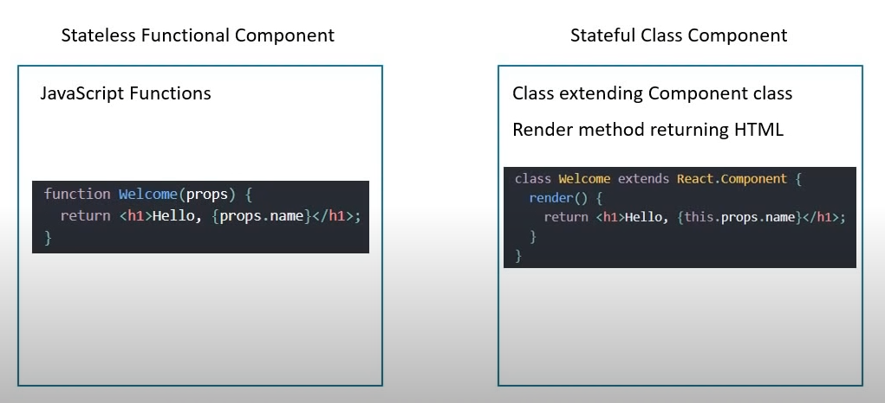
>
> ### _`Functional Component`_
>
> => คือ function javascript ที่รับค่าเข้ามาผ่าน `prop` และ return `JSX` ออกไปเป็น `UI`
>
> `Note : ` สามารถเขียนเป็น Arrow Function ได้
>
> `Note : ` `import React from 'react';` สำหรับ functional component
>
> 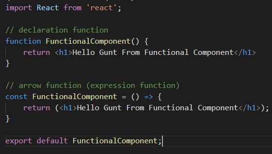
>
> ### _`Class Component`_
>
> => คือ class es6 javascript ที่รับค่าเข้ามาผ่าน `prop` และ return `JSX` ออกไปเป็น `UI`
>
> `Note : ` `import React, { Component } from 'react';` สำหรับ class component
>
> 
>
> ### _`Functional Component VS Class Component`_
>
> #### **`ข้อดี Functional Component`**
>
> - ไม่ต้องใช้ `this keyword` ในการ ref property เหมือน `class`
> - ไม่ต้องใช้ `state` ที่เป็น private state ที่ inherit จาก Component Class ของ React Library (`Class Component จะมี private state มาให้เป็น default ที่ได้จากการ inherit Component Class ของ React`)
> - การเขียน functional component เราไม่ต้องจัดการ logic ที่ซับซ้อน เรามักใช้จัดการกับ `UI` เป็นหลัก
>
> #### **`ข้อดี Class Component`**
>
> - มี feature ให้ใช้เยอะ
> - มี `state` ที่เป็น object ที่ใช้เก็บข้อมูลของ Component (`เมื่อ state มีการเปลี่ยนแปลง Component จะ re-render ใหม่`)
> - เหมาะใช้จัดการ UI,Logic ที่ซับซ้อน
> - มี `Life Cycle Hook`
>
> ## **`Props`**
>
> => คือ Object ของ property ที่เอาไว้ pass data ระหว่าง component โดยใช้ HTML attribute (`เป็นการส่ง data ระหว่าง component`)
>
> `Note : ` เรากำหนด props ผ่าน `HTML attribute` บน `child component` ใน `parent component`
>
> `Note : ` การ binding data บน `JSX` ใช้ `{ }` ครอบ data ที่ต้องการ binding
>
> `Note : ` ใน `JSX` สามารถมี tag element container ได้เพียง 1 ตัวเท่านั้น (`ต้องมีตัว tag container ครอบทุก tag ได้แค่ 1 ตัว`)
>
> `Note : ` เราไม่สามารถ assign ค่าให้ `Props` ได้ `กฎสำคัญอย่าลืม` Props ถูกสร้างมาเพื่อให้ `read-only` เท่านั้น
>
> ### _`Function Props`_
>
> => แบบ Function จะรับ props เข้ามาผ่าน parameter
>
> 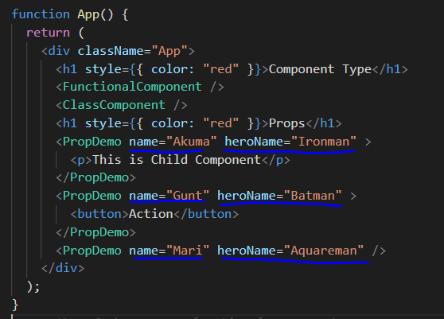
>
> 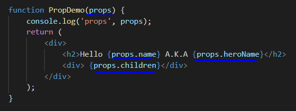
>
> ### _`Class Props`_
>
> => แบบ Class จะรับ props เข้ามาผ่าน `this.props` ที่ได้มาจากการ inherit Component ของ React Library
>
> 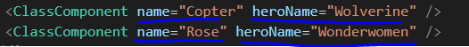
>
> 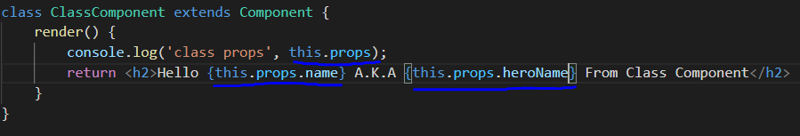
>
> `Note : ` `self closing tag` กับ `closing tag` ใน React
>
> - `self closing tag component` => ไม่ต้องมี content ข้างใน
> - `closing tag component` => มี content ข้างใน และถ้าอยากให้ render content ข้างใน ใน Component ต้องมีการ binding `props.children` ด้วย ถ้าไม่ binding มันจะไม่ถูก render เอามาโชว์
>
> 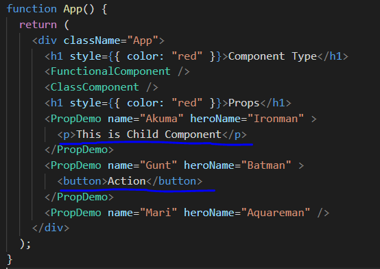
>
> 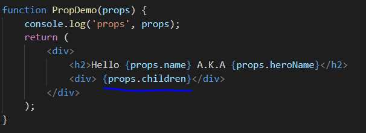
>
> ## **`State`**
>
> => เป็น object ที่เอาไว้เก็บข้อมูลของ component ถ้า state มีการเปลี่ยนแปลง component จะถูก re-render ใหม่
>
> `Note : ` `state` ของ `function component`, `class component`
>
> - `function component` => ใช้ `useState Hook`
> - `class component` => ใช้ `this.state` ที่ได้จากการ inherit Component ของ React Library
>
> `Note : ` ใน `class component` เรากำหนด `state` ใน `constructor` ของ class และเรียกใช้ `super()` เพื่อ `Initialize constructor` ของ `Component Class` ที่ inherit มา ของ React Library
>
> 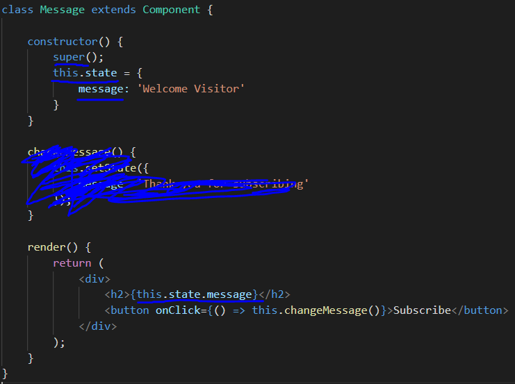
>
> ### _`setState`_
>
> => การ setState เป็นเปลี่ยนแปลงค่า state ให้ component re-render ใหม่
>
> `Note : ` เราเปลี่ยนแปลงค่าของ `state` ด้วยการ `setState` เพื่อให้ component re-render เอาค่า state ใหม่มา render แต่ถ้าเราไม่ใช้ `setState` และใช้การเปลี่ยนแปลงค่า state โดยตรงก็ทำได้เพียงแต่ component จะไม่ re-render ทำให้ค่า state ที่เปลี่ยนแปลง ไม่ถูก render เอามาโชว์ (`** สำคัญอย่าลืม`)
>
> 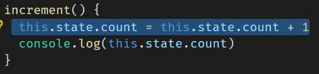
>
> 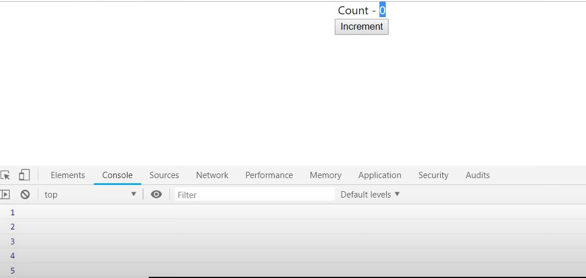
>
> `Note : ` `setState` เป็น `asynchronous` ถ้าเราอยากจะ handle อะไรก็ตามหลังจากที่มัน `setState` เสร็จ สามารถทำได้ด้วยใช้ call back function โยนเข้าไปใน parameter ตัวที่ 2 ของ `setState`
>
> `Note : ` `setState(a,b)`
>
> - `a` => เป็น object ของ state ที่เราต้องการเปลี่ยนแปลง
> - `b` => เป็น call back function ที่จะถูกเรียกหลัง `setState` เสร็จ
>
> 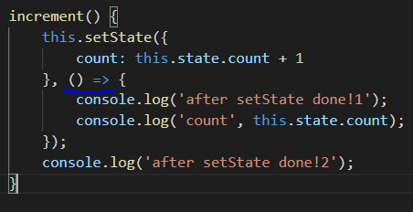
>
> `Note : ` การเรียกใช้ `setState` พร้อมกันหลายครั้ง มันจะทำงานพร้อมกันหมด เพราะเป็น `asynchronous` และ React มันจะ `group multiple setState` ให้เป็น `single setState pipe` และถ้าเราอยากจัดการกับ pipe ตัวนี้โดยให้มันทำทีละตัว และรับค่ามาจาก state ก่อนหน้า ต้อง `setState` ผ่าน `previousState` โดยมันจะไล่ทำ `setState` แต่ละตัวใน pipe นี้
>
> - **Problem**
>
> 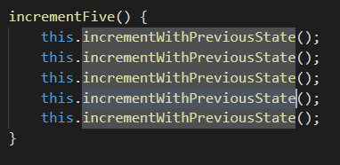
>
> 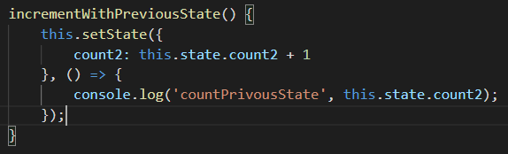
>
> 
>
> - **Solve**
>
> 
>
> 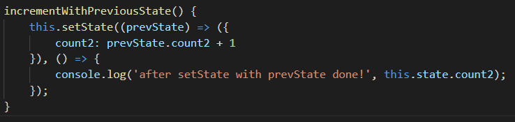
>
> 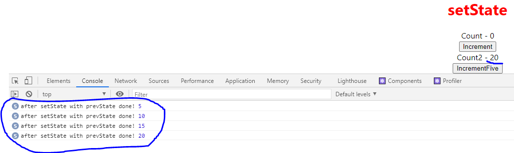
>
> `Note : ` ในการ `setState` ผ่าน `previousState` สามารถรับค่า `props` มา handle ได้
>
> 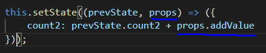
>
> ## **`Destructuring Props & State`**
>
> => เป็นเทคนิคของ Javascript ในการแตก property ของ Props,State ออกมา
>
> ### _`Function (Props)`_
>
> **Approach 1**
>
> 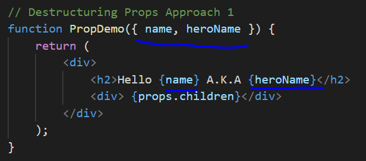
>
> **Approach 2**
>
> 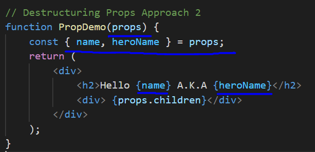
>
> ### _`Class (Props)`_
>
> 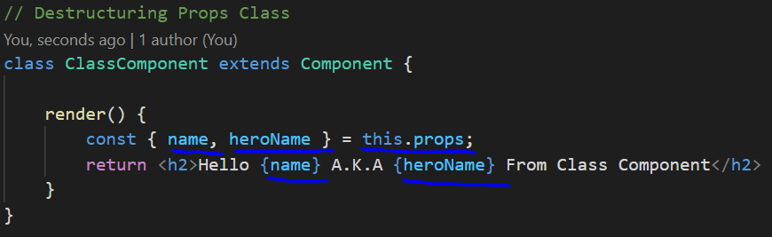
>
> ### _`Class (State)`_
>
> 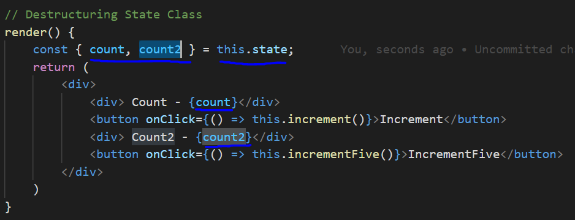
>
> ## **`Event Handling`**
>
> => เป็นการจัดการ event ผ่าน attribute event
>
> `Note : ` ปกติ Event Handling จะอยู่ใน `" "` แต่ใน React จะอยู่ใน `{ }`
>
> `Note : ` ใน `Event Handling` เราต้องส่ง `Function` เข้าไปไม่ใช่ `Function Call` เพราะ `Function Call` มันจะถูกเรียกทันทีเมื่อ Component Initial เสร็จ ซึ่งยังไม่เกิด `Event Handling` เลยแต่ Function ถูก Call ไปแล้ว ผิดวัตถุประสงค์การทำ `Event Handling`
>
> ### _`Function (Event Handling)`_
>
> 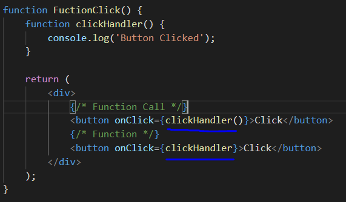
>
> ### _`Class (Event Handling)`_
>
> 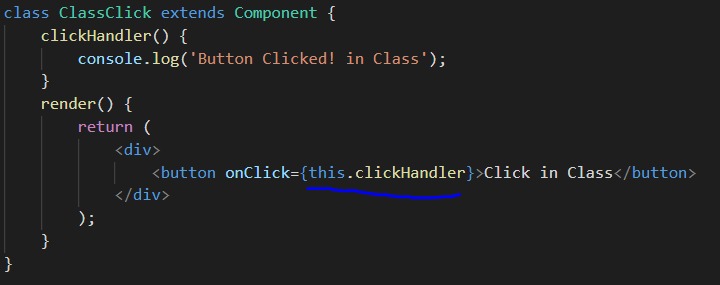
>
> ## **`Binding Event Handlers`**
>
> => เป็นการ binding ตัว function หรือ method ที่เอาไว้จัดการกับ event
>
> `Note : ` `this keyword` ใน `event handler(declaration function)` มันจะ `undefine` ทำให้เวลาเราต้องการจะ `setState(this.setState)` หรือ เรียกใช้ `state(this.state)` หรืออะไรก็ตามที่ต้องใช้ `this keyword` จะไม่สามารถใช้งานได้ เราจึงจำเป็นต้องใช้การ `binding event` เข้ามาช่วย (`สำหรับ Class Component`)
>
> ### _`Class (Binding Event)`_
>
> **Approach 1 [`Binding Event in render()`]**
>
> => ใช้ `bind(this)` -> ให้ event handler binding this ผ่าน method `bind()`
>
> `Note : ` เป็นวิธีที่ไม่แนะนำให้ใช้ เพราะจะมีผลต่อ Performance ในบาง Scenario
>
> 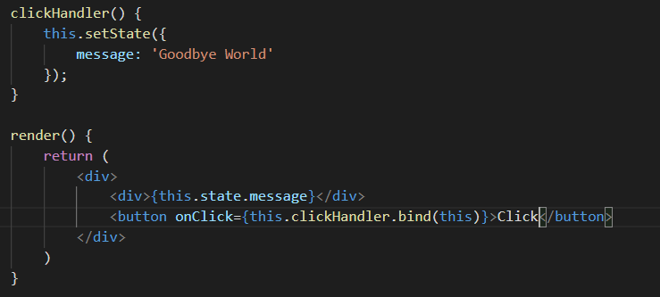
>
> **Approach 2 [`Binding Event in render()`]**
>
> => ใช้ `arrow function` -> ในการเรียกใช้ function call (`เป็นการเรียก callback function ผ่าน expression function เมื่อเกิด event`)
>
> `Note : ` จะคล้ายกับ `Approach 1` ที่จะมีผลต่อ Performance ในบาง Scenario และมันเป็นวิธีที่ง่ายที่สุดที่จะส่ง parameter เข้าไปใน `event handler`
>
> `Note : ` ยังใช้ได้ถ้า code เราไม่เกี่ยวกับการ render nested child component
>
> 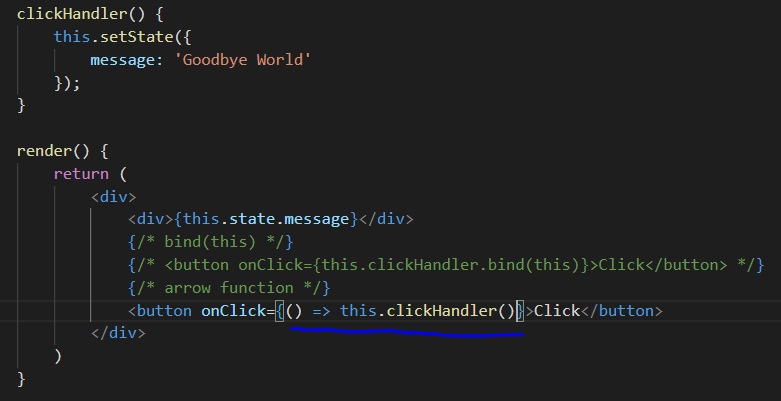
>
> **Approach 3 [`Binding Event in Class Constructor()`]**
>
> => เป็นวิธีที่เรา binding event handler ด้วย `bind()` ที่ `Constructor` แล้วนำมาเก็บที่ Property ของ Class แล้วให้ Event Handling เรียกใช้ผ่าน Property ตัวนี้ได้เลย
>
> `Note : ` เป็นวิธีที่ React Document Recommend และเป็นวิธีที่นิยมทำกันเป็น` Best Practice`
>
> 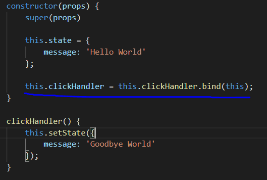
>
> 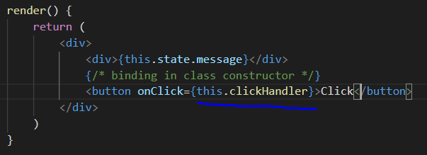
>
> **Approach 4 [`expression function`]**
>
> => เป็นวิธีที่เราเรียกใช้ expression function ใน event handling ที่เป็น Property ของ Class
>
> `Note : ` เป็นวิธีที่ React Document Recommend
>
> 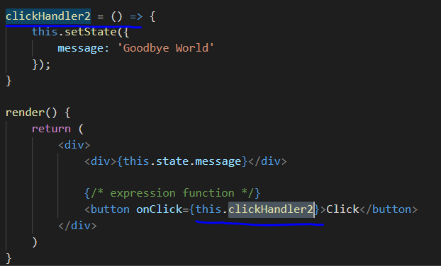
>
> ### _`Why we need to bind event handlers in Class Components in React`_
>
> #### **not use bind(this)**
>
> 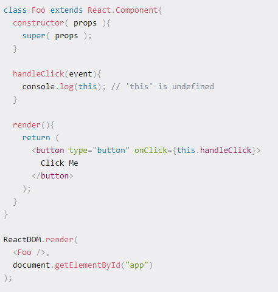
>
> #### **use bind(this)**
>
> 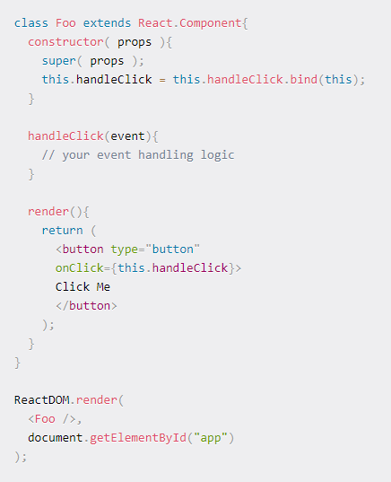
>
> - จากตัวอย่างด้านบนจะเห็นว่าถ้าเราไม่ใช้ `bind(this)`function `handleClick()` จะ error เนื่องจากมัน lost context(ไม่รู้ว่า this จะ ref ถึงอะไร) ทำให้ this ใน function undefined เราจึงต้องเอา function `handleClick()` มา `bind(this)` เพื่อระบุ specific context ให้ this ใน function สามารถ ref ถึงได้
> - https://www.freecodecamp.org/news/this-is-why-we-need-to-bind-event-handlers-in-class-components-in-react-f7ea1a6f93eb/
> - อ่านเพิ่มเติมเกี่ยวกับ this keyword ที่ Project JavascriptDojo => Folder this
>
> ## **`Methods as props`**
>
> => มันคือการส่ง `method` ไปเป็น `props` ให้กับ `child component` และ `child component` เรียกใช้ `method` ของ `parent component`
>
> 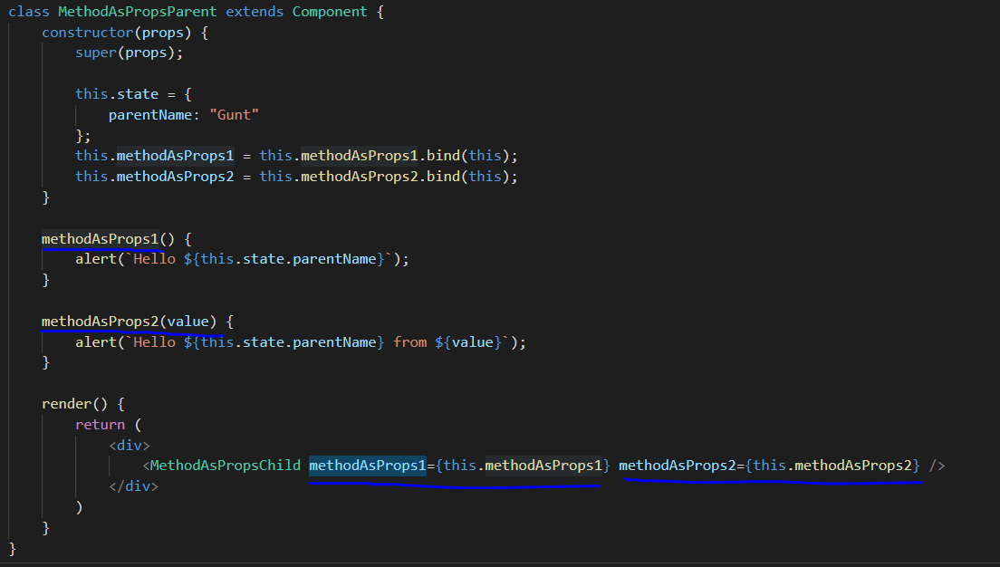
>
> 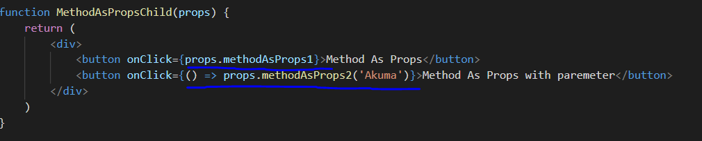
>
> ## **`Conditional Rendering`**
>
> => มี condition render อยู่ 4 แบบ
>
> ### _`if / else `_
>
> 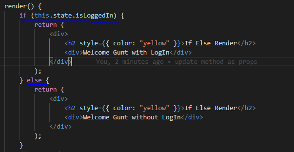
>
> `Note : ` `if / else statement` ไม่สามารถใช้งานใน `JSX` ได้ เพราะ `JSX` อนุญาตให้ใช้แค่ `function call`, `object construction` นั่นเป็นเหตุผลว่าทำไมเราถึงใช้ `if else statement` ข้างนอก `JSX` แล้วค่อย return statement ที่ contain JSX ออกไปแทนตามตัวอย่างข้างบน
>
> ### _`Element Variables`_
>
> => เป็นวิธีที่เก็บ JSX ไว้ที่ variable ของ Javascript แล้วเอาไป binding อีกที (`เราเรียก variable พวกนี้ว่า Element Variables`)
>
> 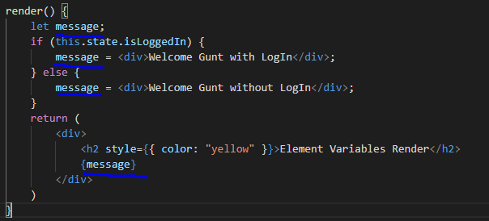
>
> ### _`Ternary conditional operator`_
>
> => เป็นวิธีการใช้ `short if(ternary conditional operator)` ในการเลือก condition ในการ render
>
> 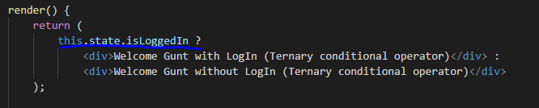
>
> 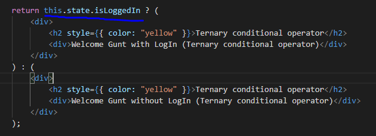
>
> ### _`Short circuit operator`_
>
> => เป็นวิธีที่เหมือนกับ `Ternary conditional operator` แต่ต่างกันตรงที่ถ้า condition ถูกต้องให้ render แต่ถ้าไม่ถูกต้องก็ไม่ได้ทำอะไร
>
> 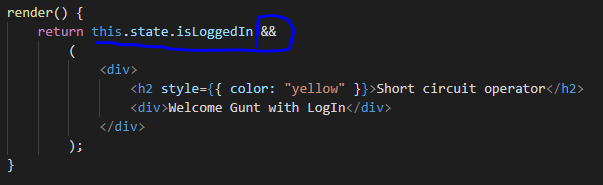
>
> `Note : ` `Ternary conditional operator` VS `Short circuit operator`
>
> - `Ternary conditional operator` => เลือก condition ในการ render เช่น ถ้า condition ถูกต้อง render 1 ถ้าไม่ถูกต้อง render 2
> - `Short circuit operator` => เช็ค condition ว่าถูกต้องมั้ย? ถ้าถูกต้อง render ถ้าไม่ถูกต้องก็ไม่ได้ทำอะไร
>
> `Note : ` best practice for Condition Rendering ควรใช้ `Ternary conditional operator` หรือ `Short circuit operator` เพื่อ `clean, readable code`
>
> ## **`List Rendering`**
>
> => เป็นการ render list item โดยการใช้ map ของ javascript เข้ามาช่วย
>
> `Note : ` ในการเขียน `javascript` ใน `JSX` ต้องเขียนใน `{ }` เสมอ การใช้ `map` ก็เช่นกัน
>
> 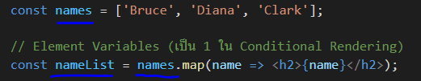
>
> 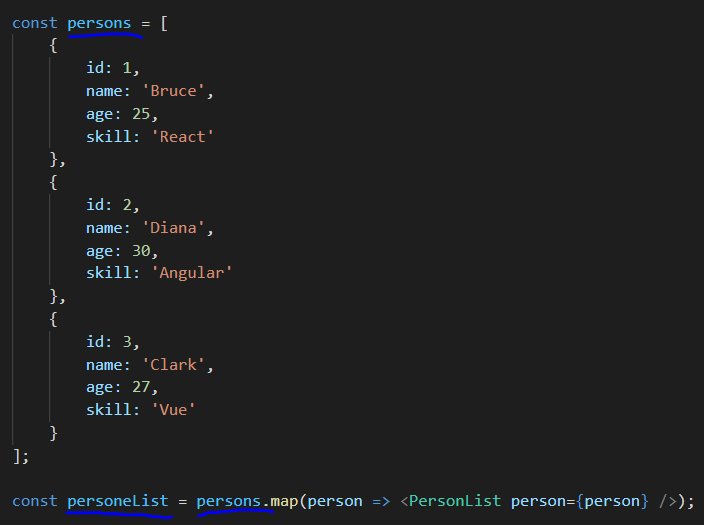
>
> 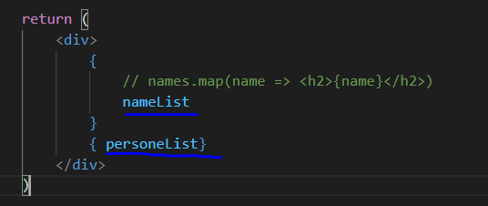
>
> ## **`Lists and Keys`**
>
> => ในการ render list item React จะต้องการให้เราระบุ key prop ให้แต่ละ component ในการ render list เพื่อบ่งบอกความเป็น unique ของแต่ละตัวใน list item
>
> 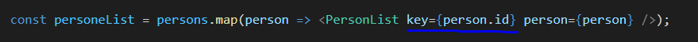
>
> `Note : ` `key prop` ที่เอาไว้ระบุความเป็น unique ของแต่ละ component จะเป็นอะไรก็ได้ที่เราแน่ใจว่ามันสามารถบ่งบอกความเป็น unique ได้ เช่น id, index, name เป็นต้น\
> `Note : ` `key prop` เอาไว้ใช้ในการ render เพื่อระบุความ unique ของแต่ละ component เท่านั้น ไม่สามารถ access เพื่อใช้งาน `key prop` ได้ เพราะฉะนั้นถ้าเรา access key prop ที่ child component มันจึง `undefined`
>
> 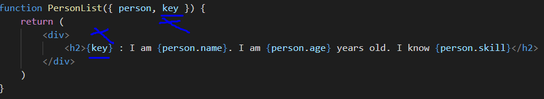
>
> `Note : ` Summary Lists and Keys
>
> - key (`props`) เป็น Html attribute ที่ต้องใช้ในการทำ List Rendering
> - key ใช้ระบุความ unique ช่วยให้ React สามารถรู้ได้ว่า item list ตัวไหนมีการ `changed`, `added`, `removed`
> - ช่วยเพิ่มประสิทธิภาพการ update UI ของ React
>
> ## **`Index as Key Anti-pattern`**
>
> => เป็นการใช้ index ของ element เป็น key สำหรับ list rendering
>
> `Note :` เงื่อนไขในการใช้ index เป็น key
>
> - item ใน list ไม่มี `unique id`
> - list เป็น static ไม่มีการเปลี่ยนแปลง (`การเปลี่ยนแปลง list จะทำให้ index ไม่สามารถ ref ได้เนื่องจาก index มีการเปลี่ยนแปลงเอามาใช้ ref unique ไม่ได้`)
> - list ต้องไม่มีการ reorder หรือ filter (`ใน react ไม่สามารถใช้ index ในการ ref เพื่อที่จะ filter หรือ reorder ได้`)
>
> `Note : ` หลีกเลี่ยงการใช้ index เป็น key สำหรับ list rendering ถ้าไม่จำเป็น
>
> ## **`Styling and CSS Basics`**
>
> => style CSS ทำได้หลายวิธี
>
> - CSS Stylesheets
> - inline style
> - CSS Modules
> - CSS in JS Libraries (`EX. Styled-components`)
>
> 1. `CSS Stylesheets`
>
>    => เขียนไฟล์ CSS ธรรมดา แล้ว import ไปใช้ที่ Component
>    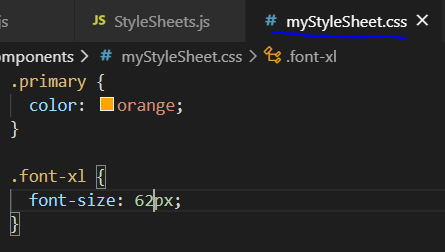
>
>    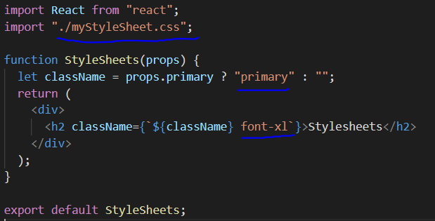
>
>    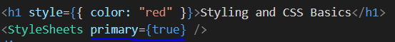
>
> `Note : ` CSS Stylesheets ธรรมดาเราสามารถ
>
> - ทำ `condition class css` ได้
> - โดยใช้ `props`, `state` มาใช้จัดการ `condition` ได้
> - สามารถทำ multi class css โดยใช้ template literal (`string interpolation`)
>
> 2.  `Inline style`
>
>     => inline style ใน react จะไม่ได้ใช้ string แต่จะใช้เป็น Object แทน และ property css จะต้องเป็น camel case เท่านั้น และ value ของ property จะต้องเป็น `string`
>
> `Note : ` Rule Inline Style
>
> - เป็น `Object`
> - property ต้องเป็น `Camel Case`
> - value ของ property ต้องเป็น `string`
>
>   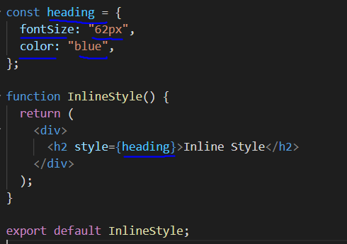
>
> 3.  `CSS Modules`
>
>     => เป็นการเขียน module สำหรับ css เวลาเรียกใช้ก็ import มาใช้เหมือนเรียกใช้ component และเราสามารถนำ css module ที่ import มา dot ใช้ชื่อ class ได้เลย ไม่จำเป็นต้องเรียกเป็นชื่อ class ในแบบ css stylesheets
>
> `Note : ` CSS Modules จะใช้ได้กับ `react-scripts` version 2.0 ขึ้นไปเท่านั้น
>
> `Note : `
>
> - ถ้าเป็น `css stylesheets` ธรรมดา ถ้าเรียกใช้ที่ `Parent Component` ที่ `Child Component` ก็สามารถใช้ได้ด้วย
> - `CSS Module` ไม่สามารถส่งต่อไปใช้ใน `Child Component` ได้ ถ้าอยากใช้ต้อง import ไปใช้ใน Component นั้นๆด้วย
>
> 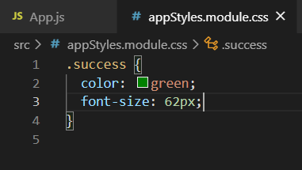
>
> 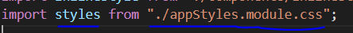
>
> 
>
> ## **`Basics of Form Handling`**
>
> => มี 3 steps ในการทำ Form Handling
>
> - `Create Html Element` สำหรับแต่ละ input ใน form
> - สร้าง `state` ของ `input` นั้นๆ แล้ว assign ให้ input ผ่าน `attribute value`
> - `binding event onChange` ให้กับ input เพื่อ `keep track input` นั้นๆผ่าน `event handler`
>
> 
>
> 
>
> 
>
> `Note : ` default ของการ submit มันจะ refresh หน้า + clear form ใหม่ ถ้าไม่อยากให้มัน refresh + clear form ต้องใช้ `event.preventDefault()`
>
> 
>
> `Note : ` ในกรณีที่เราไม่ได้มี `form tag` แล้วต้องการจะ `submit data` เราก็สร้าง `button` แล้ว `binding onClick event`
>
> `Note : ` `type="submit"` ของ button tag จะมีความสามารถในการ submit data ผ่านการกดที่ button นั้นๆหรือ ผ่าน enter key
>
> `Note : ` `type="submit"` จะมีผลต่อ form เท่านั้นเอาไปใช้กับ button ปกติ ความสามารถพวก enter key หรือ refresh หน้า + clear form จะใช้ไม่ได้ (`ทดลองมาแล้วจ้า`)
>
> ## **`Component Lifecycle Methods`**
>
> => มี 4 phase
>
> - `Mounting` => จะถูกเรียกใช้เมื่อ component ถูกสร้างและถูก insert เข้าไปใน DOM
> - `Updating` => จะถูกเรียกเมื่อ component re-render จากการที่ state หรือ props มีการเปลี่ยนแปลง
> - `Unmounting`=> จะถูกเรียกเมื่อ component ถูก remove ออกจาก DOM (`component ถูก destroy`)
> - `Error Handling` => จะถูกเรียกเมื่อเกิด Error ขึ้นระหว่างการ render ใน Lifecycle method หรือ Constructor ของ Child Component
>
> ### _`Mounting`_
>
> => มี 4 methods
>
> 1.  `constructor`
>
>     => จะถูกเรียกเมื่อ component ถูก create
>
>     `Note : ` เอาไว้ทำอะไร?
>
>     - เอาไว้ initialize state ของ component (`กำหนดค่าเริ่มต้นของ state`)
>     - เอาไว้ binding event handler
>
>     `Note : ` ข้อห้าม
>
>     - ห้ามจัดการอะไรก็ตามที่เกี่ยวกับ HTTP Request เพราะมันจะทำแค่ครั้งเดียวคือตอนที่สร้าง component ขึ้นมาครั้งแรกแล้วจะไม่ถูกเรียกอีก
>
>     `Note : ` สิ่งที่สำคัญที่ต้องรู้
>
>     - ใน constructor ของ component จะมีการเรียก `super(props)` เพื่อเป็นการเรียกใช้ constructor ของ base class (`component class`) เพื่อส่ง props ไป init ผ่าน base class
>     - เราจะสามารถใช้ `this.props` หลังจากที่ call `super(props)` เมื่อ props ถูก init ผ่าน base class เสร็จ
>     - เป็นที่เดียวที่สามารถ assign ค่าให้ state ได้โดยตรง โดยที่ไม่ต้องผ่าน `this.setState()` เพราะว่ามันเป็นการกำหนดค่าเริ่มต้นให้ state โดยปกติการ assign ค่าให้ state โดยตรงทำได้ค่า state จะเปลี่ยนแปลงเพียงแต่ จะไม่มีการ re-render ทำให้หน้า UI ไม่มีการอัพเดทค่าของ state
>
> 2.  `static getDerivedStateFromProps (X)`
>
>     => จะถูกเรียกเมื่อ `state` ของ `component` ขึ้นอยู่กับการเปลี่ยนแปลงของ `props`
>
>     `Note : `
>
>     - เป็น method ที่ไม่ค่อยได้ใช้เท่าไร
>     - ใช้ method นี้ในการ set state (`เมื่อ state ขึ้นอยู่กับการเปลี่ยนแปลงของ props`)
>     - ไม่สามารถใช้ `this keyword` ใน method นี้ได้ เช่น `this.setState` แต่จะ return object ที่เป็น new state ของ component แทน
>     - ห้ามจัดการอะไรก็ตามที่เกี่ยวกับ HTTP Request เพราะมันจะทำแค่ครั้งเดียวคือตอนที่สร้าง component ขึ้นมาครั้งแรกแล้วจะไม่ถูกเรียกอีก
>
> 3.  `render`
>
>     => เป็น method ที่เอาไว้ render UI
>
>     `Note : `
>
>     - read props & state
>     - return JSX
>     - หลังจากที่ method render ของ parent component ถูก render เสร็จ child component lifecycle method ก็จะถูก executed
>
>     `Note : ` สิ่งที่ไม่ควรทำ
>
>     - ไม่ควรเปลี่ยนแปลง state ใน method นี้
>     - ไม่ควร interact กับ DOM ใน method นี้
>     - ไม่ควร call HTTP Request
>
> 4.  `componentDidMount`
>
>     => จะถูกเรียกเมื่อ component ทั้งหมด(`ทั้ง parent,child`) ถูก init เสร็จ
>
>     `Note : `
>
>     - เป็นที่ที่เอาไว้จัดการ call HTTP Request ทั้งหมด
>     - interact with DOM ที่นี่
>
>     
>
> ### _`Updating`_
>
> => มี 5 methods
>
> 1. `static getDerivedStateFromProps(x)`
>
>    => รับ parameter เป็น props, state return เป็น Null หรือ Object ที่แสดงถึง state ที่ถูก update จะถูกเรียกทุกครั้งที่ re-render และ state ขึ้นอยู่กับ props
>
>    `Note : ` เหมือนกับ `static getDerivedStateFromProps` ของ Mounting
>
> 2. `shouldComponentUpdate(nextProps,nextState)(x)`
>
>    => จะรับ update props, state ปกติ component จะ re-render เมื่อ props หรือ state มีการเปลี่ยนแปลง method เอาไว้ compare current props,state กับ next props,state และ return เป็น true, false เพื่อบอกให้ React รู้ว่าควร update state หรือ props หรือไม่?
>
>    `Note : ` สิ่งที่ไม่ควรทำ
>
>    - ไม่ควร call HTTP Request
>    - ไม่ควร set state
>
> 3. `render`
>
>    => เหมือนกับใน Mounting
>
> 4. `getSnapshotBeforeUpdate(prevProps,prevState)(x)`
>
>    => จะถูกเรียกก่อนที่การเปลี่ยนแปลงจาก virtual DOM จะถูก reflect ไปที่ DOM
>
>    `Note : `
>
>    - เอาไว้ capture something ใน DOM
>    - เอาไว้ read current DOM state และ return value or not
>
> 5. `componentDidUpdate(prevProps,prevState,snapshot)`
>
>    => จะถูกเรียกหลังจาก method render ทำงานเสร็จใน re-render cycle(เมื่อมีการเปลี่ยนแปลงของ state,prop)
>
>    `Note : `
>
>    - เอาไว้จัดการหลังจาก parent,child component re-render หลังจาก update เสร็จ
>    - จะถูก call ครั้งเดียวเท่านั้นเมื่อมีการ re-render ในแต่ละ render cycle
>    - เอาไว้จัดการเรื่อง call HTTP Request (โดยก่อนจะ call ต้องมีการ compare prevProp,newProp หรือ prevState,newState ก่อนจะ call หรือไม่)
>
> ### _`Unmounting`_
>
> => มี 1 method
>
> 1. `componentWillUnmount`
>
>    => จะถูกเรียกเมื่อ component ถูก unmount หรือ destroy (component ไม่ได้ถูกเรียกใช้ หรือ ถูกปิดไป)
>
>    `Note : `
>
>    - เอาไว้ cancle network request
>    - เอาไว้ remove event handler
>    - เอาไว้ cancle subscription
>    - เอาไว้จัดการ invalidate timer
>    - ไม่ควร set state
>
> ### _`Error Handling`_
>
> => จะถูกเรียกเมื่อเกิด error ขึ้นระหว่าง render life cycle หรือ ใน constructor ของ child component
>
> => มี 2 methods
>
> 1. `static getDerivedStateFromError(x)`
> 2. `componentDidCatch(x)`
>
> ## **`Fragments`**
>
> => คือ tag(`React.Fragment`) ที่เอาไว้ครอบ multiple element ใน Html โดยที่เราไม่ต้องการให้มี `main tag` 1 ตัวครอบมาแสดง (`โดยปกติใน JSX multiple element จะต้องถูกครอบด้วย main tag 1 ตัว ไม่งั้นมันจะ error`)
>
> `Note : ` สามารถเขียนย่อๆ ได้เป็น (`<> </>`)
>
> **ตัวอย่างที่ใช้ main tag ปกติ**
>
> 
>
> 
>
> **ตัวอย่างที่ใช้ Fragment**
>
> 
>
> 
>
> ## **`Pure Components`**
>
> => เหมือนกับ component class ทุกอย่างต่างกันตรงที่ทุกครั้งที่ re-render ตัว pure component จะไม่ถูก re-render ใหม่
>
> `Note : ` จะ inherit PureComponent class แทน Component class
>
> `Note : ` จะใช้กับ scenario ที่เราไม่ต้องการให้มัน re-render โดยไม่จำเป็นเพื่อเพิ่ม performance ให้กับ App เช่น การ render list item 50 ตัว เป็นต้น
>
> `Note : ` ไม่ค่อยได้ใช้ ถ้าจะดูตัวอย่างค่อยกลับมาดู Video อีกรอบ
>
> ## **`Memo`**
>
> => คือการทำ Pure Component ของ Functional Component
>
> 
>
> ## **`Refs`**
>
> => ใช้ในการ focus input auto เมื่อเปิด component ขึ้นมา
>
> ### **Approach 1(`React.createRef()`)**
>
> 
>
> 
>
> ### **Approach 2(`Callback Ref`)(Old Approach)**
>
> 
>
> 
>
> 
>
> ## **`Refs with Class Components`**
>
> => เป็นการทำ ref child component จาก parent component
>
> `Note : ` https://www.youtube.com/watch?v=8aCXVC9Qmto&list=PLC3y8-rFHvwgg3vaYJgHGnModB54rxOk3&index=29
>
> ## **`Forwarding Refs`**
>
> => เป็นเทคนิคในการส่ง ref auto จาก parent ไป child component(`เป็นวิธีที่ใช้กับ Functional Component`)
>
> `Note : ` https://www.youtube.com/watch?v=RLWniwmfdq4&list=PLC3y8-rFHvwgg3vaYJgHGnModB54rxOk3&index=30
>
> ## **`Portals`**
>
> => เป็นวิธีที่นำ root component(`App Component`) มา render แทน div tag id=root ใน main template(`index.html`)
>
> `Note : ` https://www.youtube.com/watch?v=HpHLa-5Wdys&list=PLC3y8-rFHvwgg3vaYJgHGnModB54rxOk3&index=31
>
> ## **`Error Boundary`**
>
> => เป็นการจัดการกับ error ที่เกิดขึ้นระหว่าง render life cycle หรือ ใน constructor ของ child component จะทำงานผ่าน component 1 ตัวที่เป็นตัว Error Boundary ว่าถ้ามันเกิด error จะให้แสดง UI แบบไหน โดยจัดการผ่าน 2 method
>
> - `static getDerivedStateFromError(error)` => เป็นตัว handle เพื่อเอา UI ของ case error มาแสดง
> - `componentDidCatch(error,info)` => เอาไว้ log error,info ซึ่งโดย default มันจะ log error มาให้อยู่แล้วใน console ของ web browser
>
> `Note : ` Step ในการทำ Error Boundary
>
> 1. สร้าง component สำหรับทำ Error Boundary และสร้าง state ที่เอาไว้ check เพื่อแสดงเมื่อเกิด error
>
> 
>
> 
>
> 2. นำ Error Boundary Component ไปครอบ component ที่ต้องการจะ Handle Error Boundary
>
> **Example 1**
>
> 
>
> 
>
> **Example 2**
>
> 
>
> 
>
> `Note : ` ใน dev mode มันจะแสดง error เสมอ ต้องกดกากบาทออกเพื่อให้แสดง Error Boundary ที่เราจัดการไว้ ใน production mode จะไม่แสดง error อยู่แล้ว
>
> ## **`Higher Order Components`**
>
> => เป็นการจัดการเกี่ยวกับ function ที่เหมือนกันแล้วเอาไปใช้ในหลายๆ component เราจะมาเขียนใช้แค่ที่เดียวแล้ว component อื่นๆสามารถเอา function นี้ไปแชร์ใช้ได้ โดยไม่ต้องไป duplicate function ในแต่ละ component
>
> `Note : ` เป็นการส่ง function นั้นๆไปเป็น props แทนการ duplicate function (`เป็นการแชร์ function กันระหว่าง component`)
>
> ### **Step**
>
> 1. สร้าง Higher Order Component(`HOC`) ที่ข้างในจะมี component class ที่เอาไว้จัดการกับ function ที่ต้องการ share
>
> 
>
> 
>
> 2. นำ HOC ไปใช้กับ Component ที่ต้องการใช้ function นี้เหมือนกัน
>
> 
>
> 
>
> `Note : ` สิ่งที่ควรรู้ 2 ข้อ
>
> - props ที่เราส่งเข้าไปใน component ที่ผูกกับ HOC จะไม่สามารถเรียกใช้ props ได้โดยตรง เวลาจะนำ props มาใช้ต้องไปจัดการที่ HOC เพราะว่า component ที่ผูกกับ HOC ถูกทำงานผ่านตัว HOC นั่นเอง
> - โดยปกติ component ที่มาผูก HOC มันจะทำงานต่างกัน ถ้าอยากให้มันทำงานต่างกันเราสามารถใส่ parameter เพิ่มเข้าเพื่อให้มันจัดการแยกได้
>
> `Note : ` https://www.youtube.com/watch?v=l8V59zIdBXU&list=PLC3y8-rFHvwgg3vaYJgHGnModB54rxOk3&index=35
>
> ## **`Render Props`**
>
> => เป็นการ share code(`เช่น function`) ระหว่าง component ด้วย render props pattern
>
> `Note : ` https://www.youtube.com/watch?v=EZil2OTyB4w&list=PLC3y8-rFHvwgg3vaYJgHGnModB54rxOk3&index=37
>
> ## **`Context`**
>
> => เป็นวิธีที่ใช้ในการส่ง data ผ่าน context โดยไม่ต้องส่งเป็น props ลงไปเรื่อยๆให้กับ nested component
>
> ### **Step**
>
> 1. สร้าง `context` แล้ว export `contextProvider`, `contextConsumer`
>
>    
>
> 2. นำ `contextProvider` ไปครอบที่ component บนสุด(`top level component`) พร้อมทั้งส่งค่าที่ต้องการจะเอาไปใช้ใน `nested component` ผ่าน attribute value
>
>    
>
> 3. ใน `nested component` ที่ต้องการจะใช้ value ที่ share ไว้ที่ `contextProvider` ใช้ `contextConsumer` แล้วส่ง function ที่รับค่า `context value` เข้าไปข้างใน
>
>    
>
> `Note : ` advance => https://www.youtube.com/watch?v=A9WlkhdLnn0&list=PLC3y8-rFHvwgg3vaYJgHGnModB54rxOk3&index=40
>
> ## **`HTTP and React`**
>
> => React ไม่ได้มีตัวจัดการกับ Http ถ้าต้องการจะเชื่อมต่อกับ api ทำ Http request,response ต้องใช้ Http library ของ javascript เช่น `Axios` เป็นต้น

> # **`React Hooks`**
>
> => เป็น feature ของ React ที่ทำให้เราสามารถใช้ feature ต่างๆของ React ได้โดยไม่ต้องเขียน class (`ไม่ต้องใช้ Component Class`)
>
> `Note : ` React Hooks ใช้ได้แค่ใน `Functional Component` เท่านั้น ไม่สามารถนำไปใช้กับ `Class Component` ได้
>
> `Note : ` ทำไมควรใช้ React Hooks
>
> - สามารถใช้ feature ต่างๆ ของ React ได้โดยไม่ต้องเขียน Class
> - ไม่ต้องสับสนกับการใช้ `this keyword` อีกต่อไป
> - การเขียนเป็น Functional Component โดยใช้ React Hooks จะทำให้ component มีขนาดที่เล็กลง
> - ทำให้เราไม่ต้องเขียน code ที่เป็น `hierarchy(ลำดับชั้น)` ที่มีความซับซ้อนอีกต่อไป เช่น การทำ HOC เป็นต้น ซึ่งทำให้เขียน code ได้ง่ายขึ้น follow ตามได้ง่ายขึ้น
>
> ## **`useState Hook`**
>
> => เป็น method ที่เอาไว้กำหนด state โดยจะ return ออกมาเป็น array 2 ค่าคือ state,function ในการ setState(`เมื่อมีการเรียกใช้ function ในการ setState จะเกิดการ re-render`)
>
> `Note : ` เราสามารถทำ array destructuring ได้
>
> 
>
> `Note : ` โดยปกติถ้าเราใช้ Class Component ในการจัดการ state เราจะต้องทำ 3 step คือ
>
> - สร้าง component ที่ inherit `component class` ของ `react`
> - กำหนด `state`
> - สร้าง function ในการ `setState`
>
> ซึ่ง `useState` จะจัดการทั้ง 3 steps ให้เราเรียบร้อย เราสามารถเอาไปใช้งานได้เลย
>
> `Note : ` กฎของการใช้ `React Hooks`
>
> - Call Hook ที่ Top Level ของ functional component เท่านั้น
> - ไม่ Call Hook ใน loops, conditions, nested functions เด็ดขาด
> - React Hooks ใช้กับ functional component เท่านั้น
>
> `Note : ` สามารถใช้ useState with previous state ได้
>
> 
>
> `Note : ` สามารถใช้ useState with object ได้
>
> 
>
> 
>
> `Note : ` สามารถใช้ useState with array ได้
>
> 
>
> 
>
> ## **`useEffect Hook`**
>
> => เป็น `method` ที่เอาไว้จัดการพวก `side-effect` ใน `functional component` และมันเข้ามาแทนที่ `componentDidMount`, `componentDidUpdate`, `componentWillUnmount` ของ `Class Component`
>
> `Note : ` side-effect
>
> - update DOM
> - fetch data จาก API
> - setting พวก subscription หรือ timer
>
> `Note : ` `useEffect` จะทำงานทุกครั้งที่ component render(`first render + after every update`) หรือ ทำงานหลัง every render
>
> 
>
> `Note : ` โดยปกติ `useEffect` จะทำงานทุกครั้งหลังจากที่มีการ `render` เสร็จ เราสามารถกำหนด condition ให้ `useEffect` ทำงานได้ว่าถ้า state หรือ props ตัวไหนมีการเปลี่ยนแปลง `useEffect` ค่อยทำงาน จากตัวอย่างข้างล่างจะเห็นว่า `useEffect` จะทำงานก็ต่อเมื่อ state count มีการเปลี่ยนแปลงเท่านั้น (`การเปลี่ยนแปลงนั้นต้องเกิดระหว่าง render เท่านั้น ถ้าเกิดก่อน render useEffect จะไม่ทำงาน`)
>
> 
>
> ```
> useEffect(() => {
>
> },[state หรือ props ที่ต้องการให้ useEffect depend])
> ```
>
> `Note : ` run useEffect only once(`เปรียบเสมือนการทำงานของ componentDidMount ของ class`)
>
> ```
> useEffect(() => {
>
> },[]) => ตัว depend ที่อยู่ใน array ก็เป็น empty เพื่อให้ useEffect call only once หลังจาก first render เท่านั้น
> ```
>
> `Note : ` useEffect with cleanup (`useEffect unmount`) เอาไว้จัดการพวก cancle subscription, timer, event handler
>
> 
>
> `Note : ` useEffect with incorrect dependency
>
> - ref : https://www.youtube.com/watch?v=SP-NrbQHFww&list=PLC3y8-rFHvwgg3vaYJgHGnModB54rxOk3&index=54
>
> `Note : ` `Multiple useEffect` => จะต้อง group `useState`, `useEffect` ให้อยู่ด้วยกัน
>
> 
>
> ### **`Fetching data with useEffect`**
>
> **Example1(Fetch Data Only Once)**
>
> 
>
> **Example2(Fetch Data from onChange)**
>
> 
>
> 
>
> **Example3(Fetch Data from button click)**
>
> 
>
> 
>
> 

> `Note : ` ความรู้ใหม่
>
> ```
> <input /> => self closing tag => ใช้สำหรับ tag element ที่ไม่ต้องมี content ด้านใน เช่น input,img,link,hr เป็นต้น
>
> <div> </div> => closing tag => ใช้สำหรับ tag element ที่ต้องมี content ด้านใน
> ```

> ## `Trick React`
>
> ### `ES7 React/Redux/GraphQL/React-Native snippets`
>
> - `rce` => สร้าง component class ให้ auto ไม่ต้องเสียเวลาพิมพ์เอง (`**แต่อย่าลืมลบ export ข้างหน้า class ออก`)
> - `rconst` => สร้าง constructor ของ component class ให้ auto
> - `rfce` => สร้าง functional component ให้ auto
