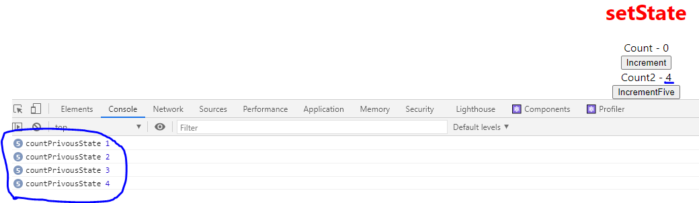

# ReactDojo

> # **`React`**
>
> เป็น Library ของ Javascript ที่เอาไว้พัฒนา Web Application
>
> ## _`Create React Command`_
>
> ```
> npx create-react-app "Project Name"
> ```
>
> `Reference : ` https://github.com/facebook/create-react-app/
>
> ## **`Structure`**
>
> ### _`node_modules`_
>
> => เป็น folder ที่เก็บ package ต่างๆของ node รวมถึง package React ที่เราจะเอาไปสร้าง Component ต่างๆ
>
> ### _`public`_
>
> => เป็น folder ที่เก็บไฟล์ public ต่างๆ เช่น index.html,พวกรูปภาพ,โลโก้
>
> ### _`src`_
>
> => เป็น folder ที่เราใช้ในการทำงานต่างๆบน React
>
> ### _`package.json`_
>
> => เป็นไฟล์ที่มีรายละเอียดพวก dependency ต่างๆที่เราลง,script ต่างๆที่เราใช้ run,เครื่องมือ tool ต่างๆที่ถูก set ไว้ในตัว project นี้
>
> ### _`App.js`_
>
> => เป็นไฟล์ root component (`component หลัก`)
>
> ### _`index.js`_
>
> => เป็นไฟล์ที่เอาไว้ render root component (`App.js`) ให้ไปแสดงแทนที่ `<div id="root"></div> ` ใน main template (`index.html`)
>
> 
>
> ### _`index.html`_
>
> => เป็นไฟล์ main template
>
> 
>
> `Note : ` flow react => index.html -> index.js -> App.js
>
> ## **`Component`**
>
> => เป็นส่วนประกอบเล็กๆที่นำมาประกอบกันเพื่อสร้างหน้า web application โดยที่แต่ละ component จะทำงานแยกกันโดยสิ้นเชิง และใน 1 component สามารถมี component ย่อยอยู่ข้างในได้ด้วย
>
> `Note : `React ใช้ Syntax `JSX` คือ Javascript XML ที่จะทำให้เราสามารถเขียน HTML บน Javascript ได้ ซึ่งเราต้อง `import React from 'react';` ก่อนถึงจะใช้ `JSX` ได้
>
> `Note : ` การเขียน `( )` ครอบ JSX จะทำให้เราสามารถเขียน JSX หลายบรรทัดได้
>
> `Note : ` การเขียน class css บน React เราใช้ attribute `className` แทน `class` ปกติ
>
> ### _`JSX differences`_
>
> 1. `class` => `className`
> 2. `for` => `htmlFor`
> 3. camel case ในการตั้งชื่อ
>    - `onclick` => `onClick`
>    - `tabindex` => `tabIndex`
>
> ### _`Component Type`_
>
> => มี 2 แบบ
>
> 1. `Stateless Functional Component` => เป็น Component ที่สร้างจาก function javascript และ render ผ่านการ return `JSX`
> 2. `Stateful Class Component` => เป็น Component ที่สร้างจาก Class ES6 ของ javascript ที่ inherit Component Class จาก React Library และ render ผ่าน method `render()`
>
> 
>
> ### _`Functional Component`_
>
> => คือ function javascript ที่รับค่าเข้ามาผ่าน `prop` และ return `JSX` ออกไปเป็น `UI`
>
> `Note : ` สามารถเขียนเป็น Arrow Function ได้
>
> `Note : ` `import React from 'react';` สำหรับ functional component
>
> 
>
> ### _`Class Component`_
>
> => คือ class es6 javascript ที่รับค่าเข้ามาผ่าน `prop` และ return `JSX` ออกไปเป็น `UI`
>
> `Note : ` `import React, { Component } from 'react';` สำหรับ class component
>
> 
>
> ### _`Functional Component VS Class Component`_
>
> #### **`ข้อดี Functional Component`**
>
> - ไม่ต้องใช้ `this keyword` ในการ ref property เหมือน `class`
> - ไม่ต้องใช้ `state` ที่เป็น private state ที่ inherit จาก Component Class ของ React Library (`Class Component จะมี private state มาให้เป็น default ที่ได้จากการ inherit Component Class ของ React`)
> - การเขียน functional component เราไม่ต้องจัดการ logic ที่ซับซ้อน เรามักใช้จัดการกับ `UI` เป็นหลัก
>
> #### **`ข้อดี Class Component`**
>
> - มี feature ให้ใช้เยอะ
> - มี `state` ที่เป็น object ที่ใช้เก็บข้อมูลของ Component (`เมื่อ state มีการเปลี่ยนแปลง Component จะ re-render ใหม่`)
> - เหมาะใช้จัดการ UI,Logic ที่ซับซ้อน
> - มี `Life Cycle Hook`
>
> ## **`Props`**
>
> => คือ Object ของ property ที่เอาไว้ pass data ระหว่าง component โดยใช้ HTML attribute (`เป็นการส่ง data ระหว่าง component`)
>
> `Note : ` เรากำหนด props ผ่าน `HTML attribute` บน `child component` ใน `parent component`
>
> `Note : ` การ binding data บน `JSX` ใช้ `{ }` ครอบ data ที่ต้องการ binding
>
> `Note : ` ใน `JSX` สามารถมี tag element container ได้เพียง 1 ตัวเท่านั้น (`ต้องมีตัว tag container ครอบทุก tag ได้แค่ 1 ตัว`)
>
> `Note : ` เราไม่สามารถ assign ค่าให้ `Props` ได้ `กฎสำคัญอย่าลืม` Props ถูกสร้างมาเพื่อให้ `read-only` เท่านั้น
>
> ### _`Function Props`_
>
> => แบบ Function จะรับ props เข้ามาผ่าน parameter
>
> 
>
> 
>
> ### _`Class Props`_
>
> => แบบ Class จะรับ props เข้ามาผ่าน `this.props` ที่ได้มาจากการ inherit Component ของ React Library
>
> 
>
> 
>
> `Note : ` `self closing tag` กับ `closing tag` ใน React
>
> - `self closing tag component` => ไม่ต้องมี content ข้างใน
> - `closing tag component` => มี content ข้างใน และถ้าอยากให้ render content ข้างใน ใน Component ต้องมีการ binding `props.children` ด้วย ถ้าไม่ binding มันจะไม่ถูก render เอามาโชว์
>
> 
>
> 
>
> ## **`State`**
>
> => เป็น object ที่เอาไว้เก็บข้อมูลของ component ถ้า state มีการเปลี่ยนแปลง component จะถูก re-render ใหม่
>
> `Note : ` `state` ของ `function component`, `class component`
>
> - `function component` => ใช้ `useState Hook`
> - `class component` => ใช้ `this.state` ที่ได้จากการ inherit Component ของ React Library
>
> `Note : ` ใน `class component` เรากำหนด `state` ใน `constructor` ของ class และเรียกใช้ `super()` เพื่อ `Initialize constructor` ของ `Component Class` ที่ inherit มา ของ React Library
>
> 
>
> ### _`setState`_
>
> => การ setState เป็นเปลี่ยนแปลงค่า state ให้ component re-render ใหม่
>
> `Note : ` เราเปลี่ยนแปลงค่าของ `state` ด้วยการ `setState` เพื่อให้ component re-render เอาค่า state ใหม่มา render แต่ถ้าเราไม่ใช้ `setState` และใช้การเปลี่ยนแปลงค่า state โดยตรงก็ทำได้เพียงแต่ component จะไม่ re-render ทำให้ค่า state ที่เปลี่ยนแปลง ไม่ถูก render เอามาโชว์ (`** สำคัญอย่าลืม`)
>
> 
>
> 
>
> `Note : ` `setState` เป็น `asynchronous` ถ้าเราอยากจะ handle อะไรก็ตามหลังจากที่มัน `setState` เสร็จ สามารถทำได้ด้วยใช้ call back function โยนเข้าไปใน parameter ตัวที่ 2 ของ `setState`
>
> `Note : ` `setState(a,b)`
>
> - `a` => เป็น object ของ state ที่เราต้องการเปลี่ยนแปลง
> - `b` => เป็น call back function ที่จะถูกเรียกหลัง `setState` เสร็จ
>
> 
>
> `Note : ` การเรียกใช้ `setState` พร้อมกันหลายครั้ง มันจะทำงานพร้อมกันหมด เพราะเป็น `asynchronous` และ React มันจะ `group multiple setState` ให้เป็น `single setState pipe` และถ้าเราอยากจัดการกับ pipe ตัวนี้โดยให้มันทำทีละตัว และรับค่ามาจาก state ก่อนหน้า ต้อง `setState` ผ่าน `previousState` โดยมันจะไล่ทำ `setState` แต่ละตัวใน pipe นี้
>
> - **Problem**
>
> 
>
> 
>
> 
>
> - **Solve**
>
> 
>
> 
>
> 
>
> `Note : ` ในการ `setState` ผ่าน `previousState` สามารถรับค่า `props` มา handle ได้
>
> 
>
> ## **`Destructuring Props & State`**
>
> => เป็นเทคนิคของ Javascript ในการแตก property ของ Props,State ออกมา
>
> ### _`Function (Props)`_
>
> **Approach 1**
>
> 
>
> **Approach 2**
>
> 
>
> ### _`Class (Props)`_
>
> 
>
> ### _`Class (State)`_
>
> 
>
> ## **`Event Handling`**
>
> `Note : ` ปกติ Event Handling จะอยู่ใน `" "` แต่ใน React จะอยู่ใน `{ }`
>
> `Note : ` ใน `Event Handling` เราต้องส่ง `Function` เข้าไปไม่ใช่ `Function Call` เพราะ `Function Call` มันจะถูกเรียกทันทีเมื่อ Component Initial เสร็จ ซึ่งยังไม่เกิด `Event Handling` เลยแต่ Function ถูก Call ไปแล้ว ผิดวัตถุประสงค์การทำ `Event Handling`
>
> ### _`Function (Event Handling)`_
>
> 
>
> ### _`Class (Event Handling)`_
>
> 
>
> ## **`Binding Event Handlers`**
>
> `Note : ` `this keyword` ใน `event handler(declaration function)` มันจะ `undefine` ทำให้เวลาเราต้องการจะ `setState(this.setState)` หรือ เรียกใช้ `state(this.state)` หรืออะไรก็ตามที่ต้องใช้ `this keyword` จะไม่สามารถใช้งานได้ เราจึงจำเป็นต้องใช้การ `binding event` เข้ามาช่วย (`สำหรับ Class Component`)
>
> ### _`Class (Binding Event)`_
>
> **Approach 1 [`Binding Event in render()`]**
>
> => ใช้ `bind(this)` -> ให้ event handler binding this ผ่าน method `bind()`
>
> `Note : ` เป็นวิธีที่ไม่แนะนำให้ใช้ เพราะจะมีผลต่อ Performance ในบาง Scenario
>
> 
>
> **Approach 2 [`Binding Event in render()`]**
>
> => ใช้ `arrow function` -> ในการเรียกใช้ function call (`เป็นการเรียก callback function ผ่าน expression function เมื่อเกิด event`)
>
> `Note : ` จะคล้ายกับ `Approach 1` ที่จะมีผลต่อ Performance ในบาง Scenario และมันเป็นวิธีที่ง่ายที่สุดที่จะส่ง parameter เข้าไปใน `event handler`
>
> `Note : ` ยังใช้ได้ถ้า code เราไม่เกี่ยวกับการ render nested child component
>
> 
>
> **Approach 3 [`Binding Event in Class Constructor()`]**
>
> => เป็นวิธีที่เรา binding event handler ด้วย `bind()` ที่ `Constructor` แล้วนำมาเก็บที่ Property ของ Class แล้วให้ Event Handling เรียกใช้ผ่าน Property ตัวนี้ได้เลย
>
> `Note : ` เป็นวิธีที่ React Document Recommend และเป็นวิธีที่นิยมทำกันเป็น` Best Practice`
>
> 
>
> 
>
> **Approach 4 [`expression function`]**
>
> => เป็นวิธีที่เราเรียกใช้ expression function ใน event handling ที่เป็น Property ของ Class
>
> `Note : ` เป็นวิธีที่ React Document Recommend
>
> 

> ## **`State & Prop`**
>
> ### _`State`_
>
> => เป็น object ที่เอาไว้เก็บข้อมูลของ component ถ้า state มีการเปลี่ยนแปลง component จะถูก re-render ใหม่
>
> ### **Approach 1 (function)**
>
> - `useState()` => เอาไว้สร้าง state ให้ component
> - `useState()` => จะ return array ที่เก็บ 2 ค่า คือ value ของ component state , function ในการ set state
>
> ```
> const [input, setInput] = useState("ค่าเริ่มต้นของ state");
> -> input => เป็น current value ของ state
> -> setInput => เป็น function ในการ set state ใหม่
> ```
>
> 
>
> ### **Approach 2 (class)**
>
> - สร้างผ่าน property `state` ที่ inherit มาจาก Component(React)
> - set state ผ่าน `this.setState()` ที่ inherit มาจาก Component(React)
> - concept state จะเหมือนกับ Approach 1 คือมี current value ของ state, function ในการ set state ใหม่ให้ component
>
> 
>
> `Note : ` ทุก component จะต้องมี state ของตัวเอง
>
> ### _`Prop`_
>
> => คือ property ที่เอาไว้ pass data ระหว่าง component โดยใช้ HTML attribute (`การส่ง data ระหว่าง component`)
>
> ### **Approach 1 (function)**
>
> 
>
> 
>
> ### **Approach 2 (class)**
>
> 
>
> - มันจะเรียกค่า prop ผ่าน `this.props` ที่ inherit จาก Component (React)
> - `this.props` มันเป็น read-only ไม่สามารถ assign ค่าให้มันได้ ทำให้ถ้าเราอยากเปลี่ยนค่า prop เราจะต้องทำผ่าน prop ที่เป็น function แล้วให้มันเปลี่ยนค่า property ของ state ที่ parent component แทน
>
> ### _`PropTypes`_
>
> => เอาไว้เช็ค `Prop` ที่ส่งเข้ามาว่าถูกต้องรึเปล่า ใน `PropTypes` จะประกอบไปด้วย Validator มากมายเลย (`เอาไว้ทำ Validate`)
>
> 
>
> `Note : ` PropTypes ไม่มีใน React ต้องลงเพิ่ม
>
> ```
> npm i prop-types --save
>
> --save เพื่อให้มัน save ลงบน package.json
> ```
>
> ## **`Handling Events`**
>
> => `event` ใน `react` จะเป็น `camel case` ที่ขึ้นต้นด้วย `on` เช่น `onClick`, `onChange`, `onKeyDown`
>
> ## **`Render (ใช้สำหรับที่เป็น Function Hook?)`**
>
> `Note : ` การ render component ที่เป็น Array จะต้องมี Unique Key ประจำ child component เพื่อที่ React จะได้รู้ว่าจะต้องไป render child component ตัวไหน
>
> ## **`React Component Life Cycle (ใช้สำหรับที่เป็น Class?)`**
>
> 1. Mounting
>    => คือช่วงที่เปิดหน้าเว็บขึ้นมา component ต่างๆจะถูก Initialize
> 2. Updating
>    => คือช่วงที่เรามีการ interact กับ component นั้นๆ แล้วทำให้เกิดการเปลี่ยนแปลง
> 3. Unmounting
>    => คือช่วงที่เราปิดหน้าเว็บ หรือ มีการเปลี่ยนหน้าเว็บแล้ว component นั้นได้หายไป
>
> 
>
> `Note : ` function ต่างๆในแต่ละ life cycle เป็นความสามารถที่ inherit มาจาก Component ที่ `import { Component } from 'react';`
>
> ## **`React Routing`**
>
> => เป็นการกำหนด route path ของการเปลี่ยนหน้า page (`กำหนด route path ให้ component เพื่อกำหนดว่า route นี้จะเอา component ไหนมา render`)
>
> `Note : `
>
> ```
> npm install react-router-dom
> ```
>
> ## **`Hook`**
>
> => เราสามารถใช้ `state` และ `feature อื่นๆของ react `ได้โดยที่ไม่ต้องเขียนเป็น `class component` อีกต่อไป สามารถนำมาเขียนใน `functional component` ได้

> `Note : ` ความรู้ใหม่
>
> ```
> <input /> => self closing tag => ใช้สำหรับ tag element ที่ไม่ต้องมี content ด้านใน เช่น input,img,link,hr เป็นต้น
>
> <div> </div> => closing tag => ใช้สำหรับ tag element ที่ต้องมี content ด้านใน
> ```

> ## `Trick React`
>
> ### `ES7 React/Redux/GraphQL/React-Native snippets`
>
> - `rce` => สร้าง component class ให้ auto ไม่ต้องเสียเวลาพิมพ์เอง (`**แต่อย่าลืมลบ export ข้างหน้า class ออก`)
> - `rconst` => สร้าง constructor ของ component class ให้ auto
> - `rfce` => สร้าง functional component ให้ auto
